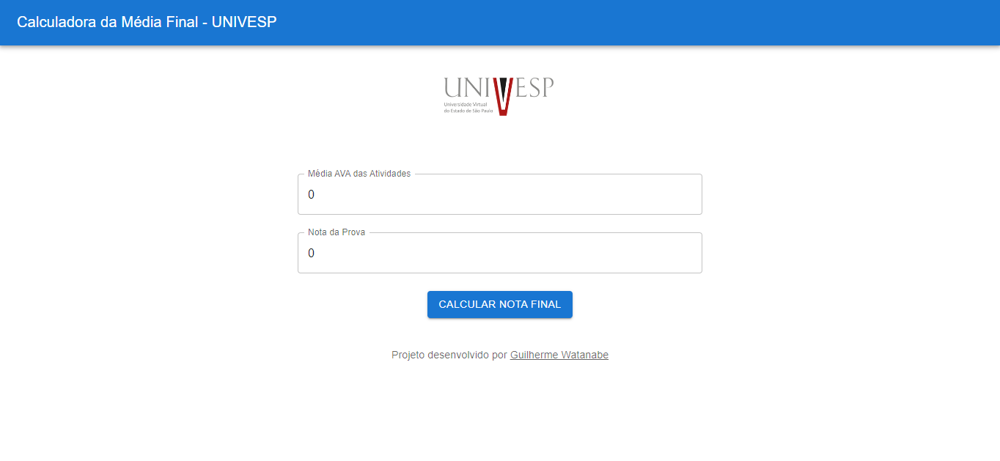

# Calculo nota final UNIVESP

Sistema para calculo da média final (prova + atividades) da faculdade UNIVESP

## Stack utilizada

## Screenshots

## Link de acesso

https://calculo-nota-un-git-947482-guilherme-watanabe-batistas-projects.vercel.app/

